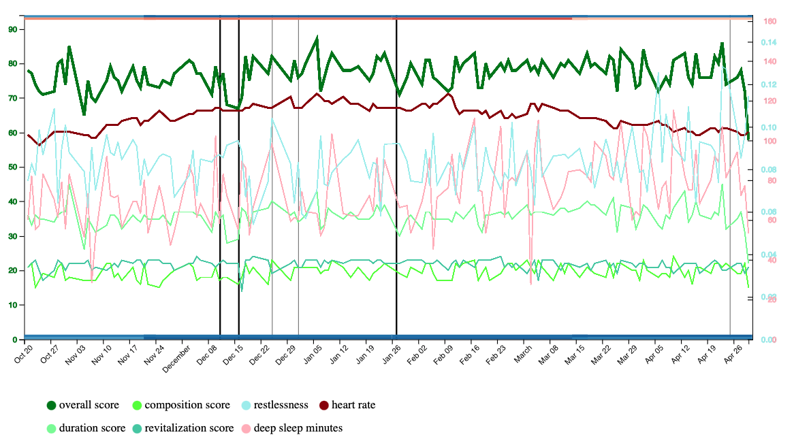
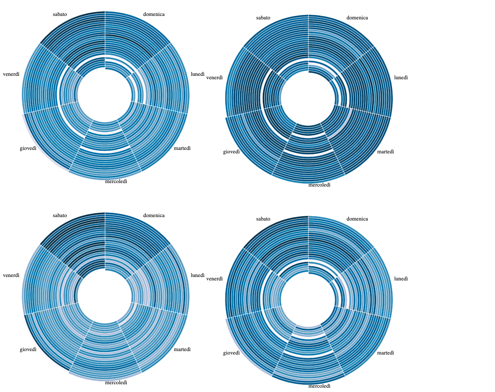
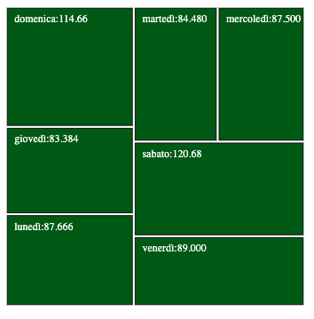

# Progetto Finale 

<br/>
Progetto per il corso di Visualizzazione delle Informazioni basato su tecnologia d3.js <br/>
Il progetto si basa sulla visualizzazione dei dati esportati dall'account Fitbit personale. <br/> 
L'intervallo dei dati su cui si è lavorato va dal 20/10/2019 al 30/04/2020 dovendo effettuare l'integrazione di diverse fonti di dati <br/>
I dati su cui si è impostato il lavoro sono stati presi da diverse fonti per cercare di trovare correlazioni e ricorrenze. I dati sono quindi di natura diversa e disomogenei. <br/>

## DATI:
* Fitbit 
* Opendata Regione Lazio:
    * Temperature minime e massime (in base a posizione: Pomezia e intervallo)
    * Precipitazioni (in base a posizione: Pomezia e intervallo)
* Consultazione ed estrazione di dataset online 
    * Tramonto

I dati Fitbit sono così organizzati:
dato | descrizione | tipo
-----|-------------|-----
overall_score | dato sintetico complessivo, somma aritmetica di composition <br/> revitalization e duration | Integer
composition_score | punteggio influenzato dal tempo in fase REM <br/> tempo sveglio durante la notte e sulle fasi di questo | Integer
revitalization_score | stima su quanto il sonno è stato riposante <br/> in base a frequenza cardiaca e agitazione durante il sonno | Integer
duration_score | punteggio ottenuto dalla durata del sonno | Integer
deep_sleep_in_minutes | quanti minuti si è stati nella fase profonda del sonno | Integer
restlessness | quanto il sonno è stato irrequieto, influenzato da <br/> cambi di posizione, movimenti etc | Double

I dati provenienti da fonti esterne a Fitbit sono state normalizzate e integrate per creare un unico dataset utilizzabile. <br/>
In quanto partendo da fonti diverse (Open Data della regione Lazio, dataset di Fitbit e pagine web), vi erano diversi dati non utilizzabili direttamente. <br/>
Prima di tutto sono stati uniti diversi mesi dei dati provenienti dagli Open Data mensili offerti dalla regione Lazio. <br/>
E' stata eseguita un'operazione di conversione per la data, in quanto Fitbit la esprimeva in formato Americato MM-DD-YYYY, mentre gli altri dati, di fonti Europee, erano in formto DD/MM/YYYY, mentre HIVE SQL, utilizzato per il join dei singoli dataset, richiede un formato del tipo: DD/MM/YY.
Il file utilizzato da hive per il join è `hive.hql` <br/>

Il progetto si compone di diverse visualizzazioni:
## Prima Visualizzazione:
La prima deriva dall'insieme dei dati e sfrutta delle line graph per trovare delle correlazioni tra dati biometrici e meteorologici. <br/>
Questa visualizzazione si compone di diversi grafici:
* Uno per confrontare i dati biometrici raccolti da Fitbit. 
* Uno per mettere in relazione i dati biometrici con la variazione delle temperature nel corso del tempo (nell'intervallo specificato).
* Uno per mettere in correlazione la presenza di precipitazioni con i dati biometrici.
Un'ulteriore visualizzazione è stata rimossa in quanto ridondante, questa visualizzazione metteva in correlazione i dati biometrici con l'andamento del tramonto. <br/>
La visualizzazione è stata rimossa in quanto apportava poco contenuto informativo rispetto al grafico della temperatura. <br/>
Per queste visualizzazioni sono state presentate diverse versioni per verificare le incidenze del sabato e domenica sui dati, dato che le altre visualizzazioni esprimevano per loro natura questa caratteristica in modo più efficace. 
L'overall score, nei grafici seguenti al primo, è stato sostituito dallo stacked graph di composition, duration e revitalization, in quanto somma aritmetica di questi. <br/>
A supporto dei grafici, sono stati inseriti degli indicatori, in modo da evidenziare le correlazioni tra misure. L'entità della correlazione è espressa come una riga orizzontale posizionata all'origine e alla fine dell'asse y in modo da non interferire con i grafici, il valore della correlazione influenza il colore dell'indicatore, dal rosso per una correlazione inversa al blu per una correlazione diretta, con l'intensità che segue il valore della correlazione tra due misure, mediante la metrica di pearson. La correlazione è stata calcolata in diversi intervalli, in modo da poter analizzare come questa variava nel tempo, ciò ha richiesto di splittare l'intero dataset per fasce, in modo da poter analizzare delle parti ben delimitate, attraverso lo script python: `pythoncorrelation_partial.py` eseguibile con python3. <br/>
Il calcolo della correlazione sull'intero dataset può essere fatto tramite `pythoncorrelation.py`. <br/>
Per il primo grafico le correlazioni graficate dall'alto verso il basso  (l'ordine di elenco rispecchia quello nel grafico dall'alto al basso) sono:
* deep_sleep_in_minutes e duration_score
* revitalization_score e restlessness
* overall_score e duration_score
* overall_score e composition  <br/>
Per il secondo grafico le correlazioni dall'alto verso il basso sono:
* overall_score e revitalization_score
* temperatura minima e resting_hearth_rate
* temperatura massima e resting_hearth_rate  <br/>
Per il terzo grafico le correlazioni dall'alto verso il basso sono:
* pioggia e overall_score  <br/>
Le relazioni riscontrate grazie a questa visualizzazione sono:
* l'overall_score è la somma algebrica di composition duration e revitalization score
* vi è correlazione inversa tra resting_hearth_rate e temperature (minime e massime)
* vi è correlazione inversa tra resting_hearth_rate e orario del tramonto
* vi è forte correlazione tra pioggia e minor valore degli score del sonno.
* vi è una variazione dei punteggi di sonno per gli esami (poco prima calo e poi aumento e dopo l'esame un'alterazione positiva e negativa) 

## Seconda Visualizzazione:
La periodicità dei grafici presenti in questa visualizzazione è settimanale, ed utilizza un grafico a spirale, che per sua natura, diversamente da un line graph, viene utilizzato per evidenziare delle periodicità.
Grazie a questa visualizzazione abbiamo confermato alcune supposizioni fatte sulla base della prima visualizzazione.
Le relazioni riscontrate grazie a questa visualizzazione sono:
* conferma di sabato e domenica come outliers rispetto alla settimana
* forte correlazione dei punteggi di martedì e mercoledì
* Da fine Marzo e tutto Aprile, il giovedì risulta un giorno in cui vi è un maggiore punteggio del sonno
* la revitalization ha un'andamento molto più regolare dell'overall score e in contro tendenza rimane alta anche durante la settimana (Martedì ha i valori più alti)
La visualizzazione rappresenta i 4 principali score del sonno raccolti da Fitbit <br/>
In senso orario troviamo:
* overall_score
* revitalization_score
* duration_score
* composition_score


## Terza Visualizzazione:
La terza ed ultima visualizzazione, è stata fatta andando a mediare il deep_sleep_in_minutes per ogni giorno. <br/>
Questo ha confermato i dati ottenuti dalla seconda visualizzazione per quanto riguarda gli andamenti giornalieri sull'intero intervallo. <br/>
Questa visualizzazione presenta la suddivisione in aree la cui grandezza corrisponde alla media sull'intero periodo di osservazione del giorno specifico della settimana. <br/>


I grafici sono interattivi, dato il gran numero di dati diversi da graficare, con il passaggio del mouse al di sopra di una legenda è possibile evidenziare la curva corrispondente. Nel caso la stessa curva sia presente in diversi grafici, questa viene evidenziata in tutto, in modo da poter avere una soluzione di continuità tra i grafici.<br/>
Per un'analisi delle curve in un determinato intervallo temporale, abbiamo deciso di aiutare la visualizzazione con l'inserimento di una finestra, ridimensionabile e scorrevole, che evidenzi un intervallo desiderato su tutti i grafici della visualizzazione. Questo risulta particolamente utile, in quanto alcune curve sono presenti in più grafici per analizzarle in diversi contesti. <br/>

## Correlazioni
Per un maggiore supporto alla visualizzazione sono state studiate e implementate tramite programmi python delle metriche che riuscissero a quantificare in modo sintetico le correlazioni individuate dal grafico. <br/>
Per quantificare quanto due serie fossero simili è stata utilizzata la metrica di Pearson (sono state testate anche quella di Kendall e Spearman ottenendo risualti simili) 
 <br/>
Attraverso la metrica di Pearson sono state determinate correlazioni dirette e inverse per stabilire se quanto riportato dai grafici fosse o meno reale e in linea con le descrizioni riportate da Fitbit. <br>
Per la verifica, attraverso il programma pythoncorrelation.py, eseguibile come:
 `````
 python3 pythoncorrelation.py
 `````
Si ottengono i risultati sull'intero intervallo:
 `````
overall 2 composition_score 0.7216263087378664
overall 2 revitalization_score 0.04514058550961356
overall 2 duration_score 0.9155343467340677
overall 2 deep_sleep_in_minutes 0.7180993978620007
overall 2 resting_heart_rate 0.17515964856149938
overall 2 restlessness -0.011600012004912208
overall 2 tmin -0.15648541237356023
overall 2 tmax -0.11003529856897838
overall 2 pioggia -0.08759056297523173
composition_score 2 overall_score 0.7216263087378664
composition_score 2 revitalization_score -0.22213899791620784
composition_score 2 duration_score 0.49477176473106477
composition_score 2 deep_sleep_in_minutes 0.6035651004808297
composition_score 2 resting_heart_rate 0.13741217591113322
composition_score 2 restlessness 0.06803755959444997
composition_score 2 tmin -0.14013901422616626
composition_score 2 tmax -0.12560666924160255
composition_score 2 pioggia -0.010692971988733993
revitalization_score 2 overall_score 0.04514058550961356
revitalization_score 2 revitalization_score -0.22213899791620784
revitalization_score 2 duration_score -0.17054227618671944
revitalization_score 2 deep_sleep_in_minutes -0.2054456785087636
revitalization_score 2 resting_heart_rate 0.25202694095346656
revitalization_score 2 restlessness -0.4846033385020221
revitalization_score 2 tmin -0.1768889883734366
revitalization_score 2 tmax -0.15807759805913116
revitalization_score 2 pioggia -0.1039738065092124
duration_score 2 overall_score 0.9155343467340677
duration_score 2 composition_score 0.49477176473106477
duration_score 2 revitalization_score -0.17054227618671944
duration_score 2 deep_sleep_in_minutes 0.6948502503887958
duration_score 2 resting_heart_rate 0.06960177020516307
duration_score 2 restlessness 0.11718687571562135
duration_score 2 tmin -0.06974350648091712
duration_score 2 tmax -0.022947933031111683
duration_score 2 pioggia -0.0732883237146473
deep_sleep_in_minutes 2 overall_score 0.7180993978620008
deep_sleep_in_minutes 2 composition_score 0.6035651004808297
deep_sleep_in_minutes 2 revitalization_score -0.2054456785087636
deep_sleep_in_minutes 2 duration_score 0.6948502503887958
deep_sleep_in_minutes 2 resting_heart_rate 0.014880816958071023
deep_sleep_in_minutes 2 restlessness 0.22047784985071386
deep_sleep_in_minutes 2 tmin -0.006592478390925329
deep_sleep_in_minutes 2 tmax 0.0230687547640661
deep_sleep_in_minutes 2 pioggia 0.031218817250696446
resting_heart_rate 2 overall_score 0.17515964856149938
resting_heart_rate 2 composition_score 0.13741217591113322
resting_heart_rate 2 revitalization_score 0.2520269409534666
resting_heart_rate 2 duration_score 0.06960177020516307
resting_heart_rate 2 deep_sleep_in_minutes 0.014880816958071025
resting_heart_rate 2 restlessness -0.18709019739060465
resting_heart_rate 2 tmin -0.609061696212945
resting_heart_rate 2 tmax -0.6453034199889537
resting_heart_rate 2 pioggia -0.1554821607167556
restlessness 2 overall_score -0.011600012004912208
restlessness 2 composition_score 0.06803755959444997
restlessness 2 revitalization_score -0.48460333850202214
restlessness 2 duration_score 0.11718687571562135
restlessness 2 deep_sleep_in_minutes 0.22047784985071386
restlessness 2 resting_heart_rate -0.18709019739060465
restlessness 2 tmin 0.23460738556479854
restlessness 2 tmax 0.18721836584236207
restlessness 2 pioggia 0.16333580442638157
tmin 2 overall_score -0.15648541237356023
tmin 2 composition_score -0.14013901422616626
tmin 2 revitalization_score -0.17688898837343658
tmin 2 duration_score -0.06974350648091711
tmin 2 deep_sleep_in_minutes -0.006592478390925328
tmin 2 resting_heart_rate -0.609061696212945
tmax 2 overall_score -0.11003529856897837
tmax 2 composition_score -0.12560666924160255
tmax 2 revitalization_score -0.15807759805913113
tmax 2 duration_score -0.022947933031111683
tmax 2 deep_sleep_in_minutes 0.023068754764066102
tmax 2 resting_heart_rate -0.6453034199889537
  `````
Nella prima visualizzazione le correlazioni sono state misurate per intervalli temporali, calcolabili come:
 `````
 python3 pythoncorrelation_partial.py
 `````
Le correlazioni dirette possono essere considerate:
* assenti o deboli per valori tra 0 e 0,3
* notevoli per valori tra 0,3 e 0,7
* forti per valori tra 0,7 e 1 <br/>
Stessa scala può essere utilizzata per correlazioni inverse con il segno negativo. <br/>
Ad esempio vi è la conferma che tra heart rate e le temperature vi sia una correlazione inversa notevole e come dalla nostra valutazione iniziale, sulla prima visualizzazione, vi è una forte correlazione tra overall_score e duration_score. <br/>
Oltre alle correlazioni, è stato ricercato un algoritmo che definisse una relazione di similarità tra curve, nella ricerca è stata indivisuata la metrica: distanza di Fréchet. <br/>
La distanza Fréchet è una misura di similarità fra le curve che tiene conto della posizione e dell'ordinamento dei punti lungo le curve.
Per il calcolo si può utilizzare il file pythondiffcurves, eseguibile come:
 `````
 python3 pythondiffcurves.py
 `````
Esempio:
  `````
    distance hr 2 hr: test 0.0
    distance hr 2 rev 50.0
    distance hr 2 duration 36.0
    distance hr 2 composition 52.0
  `````

# Run
Run with Docker: <br/>
 `````
  docker build -t demoinfovisfinaleimg .
  docker run -dit --name demoinfovisfinalecontainer -p 8080:80 demoinfovisfinaleimg
 `````
All'indirizzo della macchina che ha lanciato i comandi docker, esposto sulla porta 80, al path / troverete i grafici della prima visualizzazione. <br/>
Al path /index-spirale.html troverete il grafico della seconda visualizzazione per analizzare al meglio le periodicità settimanali. <br/>
Al path /index-deepsleep-day.html troverete la terza visualizzazione calcolata sulla base della media dei minuti di sonno profondo per ogni giorno della settimana. <br/>
Al path /indexv1.html troverete i grafici della prima visualizzazione con la possibilità di creare finestre indipendenti per delimitare degli intervalli di tempo sui tre grafici. <br/>

## Nota:
Il progetto è integrato con Docker Hub, evitando la necessità di build locale dell'immagine:

 `````
  docker pull crismon01/progettofinaleinfovis:latest 
  docker run -dit --name demoinfovisfinalecontainer -p 8080:80 crismon01/progettofinaleinfovis:latest
 `````

Utilizzo del logo da parte della comunità universitaria.
Il logo dell’Università degli Studi Roma Tre è un marchio registrato di proprietà esclusiva dell’Università e può essere utilizzato dalla comunità universitaria nell’ambito delle attività scientifiche, didattiche e comunicative.
